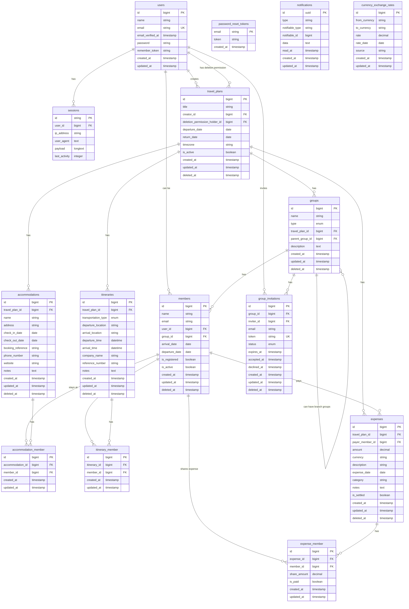

# Database Structure

Below is the entity-relationship diagram for the TripQuota application database:

## Key Relationships

1. **Users and Travel Plans**:
   - A user can create multiple travel plans
   - A user can hold deletion permission for multiple travel plans

2. **Travel Plans and Groups**:
   - A travel plan has one or more groups
   - Groups can be of type 'core' or 'branch'
   - Branch groups can have a parent group

3. **Groups and Members**:
   - A group consists of multiple members
   - A member belongs to a specific group
   - A member can optionally be linked to a registered user

4. **Travel Plans and Accommodations/Itineraries/Expenses**:
   - A travel plan has multiple accommodations, itineraries, and expenses
   - These are shared among members through pivot tables

5. **Expense Tracking**:
   - Expenses are recorded with a payer member
   - Expenses are shared among members through the expense_member pivot table
   - Currency exchange rates are tracked for multi-currency support

6. **Group Invitations**:
   - Users can invite others to join groups via email
   - Invitations have statuses (pending, accepted, declined, expired)

7. **Notifications**:
   - System uses Laravel's notification system with polymorphic relationships

## データベースの役割

各テーブルの役割と目的を日本語で説明します：

1. **users**:
   - ユーザー情報を管理するテーブル
   - サイトに登録したアカウント情報（名前、メールアドレス、パスワード）を保存
   - 認証・認可の基本となるデータ

2. **password_reset_tokens**:
   - パスワードリセット機能のためのトークンを管理
   - パスワードを忘れた場合のリセット処理に使用

3. **sessions**:
   - ユーザーセッション情報を保存
   - ログイン状態の維持や追跡に使用

4. **travel_plans**:
   - 旅行計画の基本情報を管理
   - タイトル、出発日、帰宅日、タイムゾーンなどの旅行の基本情報を保存
   - 作成者と削除権限保持者の情報も管理

5. **groups**:
   - 旅行メンバーのグループを管理
   - コアグループ（全メンバー）と班グループ（一部メンバー）の区別
   - 親子関係のある班グループの構造も表現可能

6. **members**:
   - 旅行に参加するメンバー情報を管理
   - 登録ユーザーと未登録メンバー両方を扱える
   - 各メンバーの到着日・出発日などの情報も保存

7. **accommodations**:
   - 宿泊先情報を管理
   - ホテル名、住所、チェックイン・チェックアウト日、予約番号などを保存

8. **accommodation_member**:
   - 宿泊先とメンバーの関連付けを管理する中間テーブル
   - どのメンバーがどの宿泊施設に滞在するかを記録

9. **itineraries**:
   - 旅程情報を管理
   - 交通手段、出発地、到着地、出発時刻、到着時刻などの移動情報を保存
   - 航空会社や便名などの参照情報も記録

10. **itinerary_member**:
    - 旅程とメンバーの関連付けを管理する中間テーブル
    - どのメンバーがどの旅程に参加するかを記録

11. **expenses**:
    - 旅行中の支出情報を管理
    - 支払者、金額、通貨、説明、日付、カテゴリなどの情報を保存
    - 割り勘計算の基礎となるデータ

12. **expense_member**:
    - 支出とメンバーの関連付けを管理する中間テーブル
    - 各メンバーの負担額と支払い状況を記録

13. **notifications**:
    - 通知情報を管理
    - 未読/既読状態や通知内容のデータを保存
    - Laravelのポリモーフィック関係を使用して様々なエンティティに関連付け可能

14. **group_invitations**:
    - グループへの招待情報を管理
    - 招待者、招待メールアドレス、トークン、ステータスなどを保存
    - 招待の有効期限や承諾/拒否の日時も記録

15. **currency_exchange_rates**:
    - 通貨間の為替レートを管理
    - 異なる通貨での支出を一貫した通貨で計算するために使用
    - レート適用日やデータソースも記録

これらのテーブルが連携することで、複数人での旅行計画の共有、旅程の管理、宿泊先の記録、そして最終的な割り勘計算までをシームレスに行うことができます。
