# TripQuotaデータベース構造

## ER図

```mermaid
erDiagram
    users {
        id bigint PK
        name string
        email string UK
        email_verified_at timestamp
        password string
        remember_token string
        created_at timestamp
        updated_at timestamp
    }
    
    accounts {
        id bigint PK
        user_id bigint FK
        name string
        display_name string
        thumbnail_path string
        is_active boolean
        created_at timestamp
        updated_at timestamp
        deleted_at timestamp
    }
    
    oauth_providers {
        id bigint PK
        user_id bigint FK
        provider string
        provider_user_id string
        access_token string
        refresh_token string
        expires_at timestamp
        created_at timestamp
        updated_at timestamp
    }
    
    user_settings {
        id bigint PK
        user_id bigint FK
        language string
        timezone string
        currency string
        email_notifications boolean
        push_notifications boolean
        notification_preferences json
        ui_preferences json
        created_at timestamp
        updated_at timestamp
    }
    
    password_reset_tokens {
        email string PK
        token string
        created_at timestamp
    }
    
    sessions {
        id string PK
        user_id bigint FK
        ip_address string
        user_agent text
        payload longtext
        last_activity integer
    }
    
    travel_plans {
        id bigint PK
        title string
        creator_id bigint FK
        deletion_permission_holder_id bigint FK
        departure_date date
        return_date date
        timezone string
        is_active boolean
        created_at timestamp
        updated_at timestamp
        deleted_at timestamp
    }
    
    groups {
        id bigint PK
        name string
        type enum
        travel_plan_id bigint FK
        parent_group_id bigint FK
        description text
        created_at timestamp
        updated_at timestamp
        deleted_at timestamp
    }
    
    system_branch_group_keys {
        id bigint PK
        group_id bigint FK
        key string UK
        is_active boolean
        created_at timestamp
        updated_at timestamp
        deleted_at timestamp
    }
    
    branch_group_connections {
        id bigint PK
        source_group_id bigint FK
        target_group_id bigint FK
        created_by_user_id bigint FK
        is_active boolean
        created_at timestamp
        updated_at timestamp
        deleted_at timestamp
    }
    
    members {
        id bigint PK
        name string
        email string
        user_id bigint FK
        group_id bigint FK
        arrival_date date
        departure_date date
        is_active boolean
        created_at timestamp
        updated_at timestamp
        deleted_at timestamp
    }
    
    member_account_associations {
        id bigint PK
        member_id bigint FK
        account_id bigint FK
        previous_account_id bigint FK
        changed_by_user_id bigint FK
        change_reason text
        created_at timestamp
        updated_at timestamp
    }
    
    accommodations {
        id bigint PK
        travel_plan_id bigint FK
        name string
        address string
        check_in_date date
        check_out_date date
        booking_reference string
        phone_number string
        website string
        notes text
        created_at timestamp
        updated_at timestamp
        deleted_at timestamp
    }
    
    accommodation_member {
        id bigint PK
        accommodation_id bigint FK
        member_id bigint FK
        created_at timestamp
        updated_at timestamp
    }
    
    itineraries {
        id bigint PK
        travel_plan_id bigint FK
        transportation_type enum
        departure_location string
        arrival_location string
        departure_time datetime
        arrival_time datetime
        company_name string
        reference_number string
        notes text
        created_at timestamp
        updated_at timestamp
        deleted_at timestamp
    }
    
    itinerary_member {
        id bigint PK
        itinerary_id bigint FK
        member_id bigint FK
        created_at timestamp
        updated_at timestamp
    }
    
    travel_locations {
        id bigint PK
        travel_plan_id bigint FK
        group_id bigint FK
        added_by_member_id bigint FK
        name string
        address string
        google_maps_url string
        latitude decimal
        longitude decimal
        description text
        visit_datetime datetime
        category string
        image_path string
        notes text
        created_at timestamp
        updated_at timestamp
        deleted_at timestamp
    }
    
    expenses {
        id bigint PK
        travel_plan_id bigint FK
        payer_member_id bigint FK
        amount decimal
        currency string
        description string
        expense_date date
        category string
        notes text
        is_settled boolean
        created_at timestamp
        updated_at timestamp
        deleted_at timestamp
    }
    
    expense_member {
        id bigint PK
        expense_id bigint FK
        member_id bigint FK
        share_amount decimal
        is_paid boolean
        created_at timestamp
        updated_at timestamp
    }
    
    expense_settlements {
        id bigint PK
        travel_plan_id bigint FK
        payer_member_id bigint FK
        receiver_member_id bigint FK
        amount decimal
        currency string
        is_settled boolean
        settlement_date date
        settlement_method string
        notes text
        created_at timestamp
        updated_at timestamp
        deleted_at timestamp
    }
    
    travel_documents {
        id bigint PK
        travel_plan_id bigint FK
        uploaded_by_member_id bigint FK
        title string
        file_path string
        file_type string
        file_size bigint
        category string
        description text
        is_shared_with_all boolean
        created_at timestamp
        updated_at timestamp
        deleted_at timestamp
    }
    
    document_member {
        id bigint PK
        travel_document_id bigint FK
        member_id bigint FK
        created_at timestamp
        updated_at timestamp
    }
    
    notifications {
        id uuid PK
        type string
        notifiable_type string
        notifiable_id bigint
        data text
        read_at timestamp
        created_at timestamp
        updated_at timestamp
    }
    
    group_invitations {
        id bigint PK
        group_id bigint FK
        inviter_id bigint FK
        email string
        token string UK
        status enum
        expires_at timestamp
        accepted_at timestamp
        declined_at timestamp
        created_at timestamp
        updated_at timestamp
        deleted_at timestamp
    }
    
    currency_exchange_rates {
        id bigint PK
        from_currency string
        to_currency string
        rate decimal
        rate_date date
        source string
        created_at timestamp
        updated_at timestamp
    }
    
    activity_logs {
        id bigint PK
        user_id bigint FK
        subject_type string
        subject_id bigint
        action string
        description text
        properties json
        ip_address string
        user_agent string
        created_at timestamp
        updated_at timestamp
    }
    
    admin_users {
        id bigint PK
        name string
        email string UK
        password string
        role string
        permissions json
        last_login_at timestamp
        last_login_ip string
        is_active boolean
        remember_token string
        created_at timestamp
        updated_at timestamp
        deleted_at timestamp
    }
    
    users ||--o{ accounts : "has"
    users ||--o{ oauth_providers : "has"
    users ||--o{ user_settings : "has"
    users ||--o{ sessions : "has"
    users ||--o{ travel_plans : "creates"
    users ||--o{ travel_plans : "has deletion permission"
    users ||--o{ members : "can be"
    users ||--o{ group_invitations : "invites"
    users ||--o{ branch_group_connections : "creates"
    users ||--o{ member_account_associations : "changes"
    users ||--o{ activity_logs : "performs"
    
    accounts ||--o{ member_account_associations : "is associated with"
    accounts ||--o{ member_account_associations : "was previously"
    
    travel_plans ||--o{ groups : "has"
    travel_plans ||--o{ accommodations : "has"
    travel_plans ||--o{ itineraries : "has"
    travel_plans ||--o{ expenses : "has"
    travel_plans ||--o{ travel_locations : "has"
    travel_plans ||--o{ travel_documents : "has"
    travel_plans ||--o{ expense_settlements : "has"
    
    groups ||--o{ groups : "can have branch groups"
    groups ||--o{ members : "has"
    groups ||--o{ group_invitations : "has"
    groups ||--o{ system_branch_group_keys : "has"
    groups ||--o{ branch_group_connections : "is source of"
    groups ||--o{ branch_group_connections : "is target of"
    groups ||--o{ travel_locations : "has"
    
    members ||--o{ accommodation_member : "stays at"
    members ||--o{ itinerary_member : "travels on"
    members ||--o{ expenses : "pays"
    members ||--o{ expense_member : "shares expense"
    members ||--o{ member_account_associations : "has"
    members ||--o{ travel_locations : "adds"
    members ||--o{ travel_documents : "uploads"
    members ||--o{ document_member : "can view"
    members ||--o{ expense_settlements : "pays"
    members ||--o{ expense_settlements : "receives"
    
    accommodations ||--o{ accommodation_member : "has"
    itineraries ||--o{ itinerary_member : "has"
    expenses ||--o{ expense_member : "has"
    travel_documents ||--o{ document_member : "has"
```

## テーブル概要

### 認証・ユーザー関連
- `users`: ユーザー認証情報
- `accounts`: ユーザープロフィール情報（アカウント名、サムネイル画像など）
- `oauth_providers`: OAuth認証プロバイダー連携情報
- `user_settings`: ユーザー設定情報（言語、タイムゾーン、通知設定など）
- `password_reset_tokens`: パスワードリセット用トークン
- `sessions`: ユーザーセッション情報
- `admin_users`: サイト管理者情報

### 旅行計画関連
- `travel_plans`: 旅行計画の基本情報
- `groups`: 旅行メンバーのグループ（コアグループと班グループ）
- `system_branch_group_keys`: 班グループの一意識別子
- `branch_group_connections`: 異なる旅行計画の班グループ間の接続情報
- `members`: 旅行に参加するメンバー情報
- `member_account_associations`: メンバーとアカウントの関連付け（アカウント変更履歴）

### 旅程・宿泊関連
- `accommodations`: 宿泊先情報
- `accommodation_member`: 宿泊先とメンバーの関連付け
- `itineraries`: 旅程情報
- `itinerary_member`: 旅程とメンバーの関連付け
- `travel_locations`: 旅行先の場所情報（観光地、レストランなど）
- `travel_documents`: 旅行関連ドキュメント（チケット、予約確認書など）
- `document_member`: ドキュメントの閲覧権限

### 費用・精算関連
- `expenses`: 旅行中の支出情報
- `expense_member`: 支出とメンバーの関連付け
- `expense_settlements`: 割り勘の最終精算状況
- `currency_exchange_rates`: 通貨間の為替レート

### システム機能関連
- `notifications`: 通知情報
- `group_invitations`: グループへの招待情報
- `activity_logs`: システム内の活動ログ
